# Data Flow Diagrams - Hệ Thống Quản Lý Tiệc Cưới Everlasting

## 📋 Mục Lục
1. [Architecture Overview](#architecture-overview)
2. [Authentication Flow](#1-authentication-flow)
3. [Create Dish Flow](#2-create-dish-flow)
4. [Create Booking Flow](#3-create-booking-flow)
5. [Create Invoice Flow](#4-create-invoice-flow)
6. [Generate Report Flow](#5-generate-report-flow)
7. [Permission Check Flow](#6-permission-check-flow)

---

## ARCHITECTURE OVERVIEW


---

## 1. AUTHENTICATION FLOW

### 1.1. Login Flow

```mermaid
sequenceDiagram
    participant U as User
    participant LC as Login.jsx
    participant API as api.js
    participant BE as Backend
    participant DB as Database
    
    U->>LC: Enter username/password
    U->>LC: Click "Đăng nhập"
    LC->>LC: handleLogin()
    LC->>API: login(username, password)
    
    API->>BE: POST /api/nguoidung/login
    Note over API,BE: { tenDangNhap, matKhau }
    
    BE->>BE: authMiddleware (skip for login)
    BE->>BE: Controller: login()
    BE->>DB: findByUsername(username)
    DB-->>BE: User data
    
    BE->>BE: comparePassword(input, hashed)
    alt Password valid
        BE->>BE: generateAccessToken(user)
        BE->>BE: generateRefreshToken()
        BE->>DB: saveRefreshToken(userId, token)
        BE-->>API: 200: { accessToken, refreshToken, user }
        API->>API: localStorage.setItem('accessToken')
        API->>API: localStorage.setItem('refreshToken')
        API->>API: localStorage.setItem('user')
        API-->>LC: Success
        LC->>LC: navigate('/home')
        LC-->>U: Show "Đăng nhập thành công"
    else Password invalid
        BE-->>API: 401: { message: "Sai mật khẩu" }
        API-->>LC: Error
        LC-->>U: Show error alert
    end
```



**Related Files:**
- Frontend: `src/pages/login.jsx`
- API: `src/services/api.js` (login)
- Backend: `src/controller/nguoidung.controller.js` (login)
- Model: `src/models/nguoidung.model.js` (findByUsername)

---

### 1.2. Auto Token Refresh Flow


**Related Code:**
```javascript
// frontend/src/services/api.js
const fetchWithAuth = async (url, options = {}) => {
  try {
    const response = await fetch(url, {
      ...options,
      headers: {
        ...options.headers,
        'Authorization': `Bearer ${localStorage.getItem('accessToken')}`
      }
    });

    if (response.status === 401) {
      // Try refresh token
      const newToken = await refreshToken();
      if (newToken) {
        // Retry with new token
        return fetch(url, {
          ...options,
          headers: {
            ...options.headers,
            'Authorization': `Bearer ${newToken}`
          }
        });
      }
    }

    return response;
  } catch (error) {
    throw error;
  }
};
```

---

## 2. CREATE DISH FLOW

```mermaid
sequenceDiagram
    participant U as User
    participant MM as MenuManagement.jsx
    participant API as api.js
    participant R as Routes
    participant MW as Middleware Chain
    participant C as Controller
    participant S as Service
    participant M as Model
    participant DB as Database
    
    U->>MM: Fill form & click "Lưu"
    MM->>MM: handleSaveMonAn()
    MM->>API: createMonAn(payload)
    
    API->>R: POST /api/monan/create
    Note over API,R: Authorization: Bearer {token}<br/>Body: { tenMonAn, maLoaiMonAn, donGia }
    
    R->>MW: authMiddleware
    MW->>MW: verifyToken()
    MW->>MW: req.user = decoded
    
    R->>MW: requirePermission('QUAN_LY_MON_AN')
    MW->>DB: checkUserPermission(user.maNhom, 'QUAN_LY_MON_AN')
    DB-->>MW: hasPermission = true
    
    R->>MW: createLimiter
    MW->>MW: Check rate limit (5 req/min)
    
    R->>MW: validateCreateDish
    MW->>MW: Joi.validate(req.body)
    
    R->>C: createDish(req, res)
    C->>S: validateDishCreation(tenMonAn, maLoaiMonAn)
    
    S->>M: findByTenMonAn(tenMonAn)
    M->>DB: SELECT * FROM MONAN WHERE TenMonAn = ?
    DB-->>M: null (not found)
    M-->>S: null
    
    S->>M: LoaiMonAn.findById(maLoaiMonAn)
    M->>DB: SELECT * FROM LOAIMONAN WHERE MaLoaiMonAn = ?
    DB-->>M: LoaiMonAn data
    M-->>S: LoaiMonAn exists
    
    S-->>C: Validation passed
    
    C->>M: Dish.create(data)
    M->>DB: INSERT INTO MONAN (TenMonAn, MaLoaiMonAn, DonGia, ...) VALUES (...)
    DB-->>M: New dish with MaMonAn
    M-->>C: Created dish
    
    C-->>R: 201: { success: true, data: dish }
    R-->>API: HTTP 201 Response
    API-->>MM: Success
    MM->>MM: fetchMonAn() - Reload list
    MM-->>U: Show "Tạo món ăn thành công"
```



**Related Files:**
- Frontend: `src/pages/MenuManagement.jsx`
- API: `src/services/api.js`
- Route: `src/routes/monan.routes.js`
- Middleware: 
  - `src/middleware/auth.middleware.js` (authMiddleware)
  - `src/middleware/authorization.middleware.js` (requirePermission)
  - `src/middleware/ratelimit.middleware.js` (createLimiter)
  - `src/middleware/validations/validateMonAn.js` (validateCreateDish)
- Controller: `src/controller/monan.controller.js` (createDish)
- Service: `src/services/monan.services.js` (validateDishCreation)
- Model: `src/models/monan.model.js` (create, findByTenMonAn)

---

### 2.1. Error Case: Duplicate Dish Name

```mermaid
sequenceDiagram
    participant U as User
    participant MM as MenuManagement.jsx
    participant S as Service
    participant M as Model
    participant DB as Database
    
    U->>MM: Enter "Tôm Hùm Alaska" (exists)
    MM->>S: validateDishCreation("Tôm Hùm Alaska", 1)
    S->>M: findByTenMonAn("Tôm Hùm Alaska")
    M->>DB: SELECT * FROM MONAN WHERE TenMonAn = ?
    DB-->>M: Existing dish data
    M-->>S: Dish exists
    S-->>MM: throw Error("Ten mon an da ton tai")
    MM-->>U: Show error alert
```



---

## 3. CREATE BOOKING FLOW

```mermaid
sequenceDiagram
    participant U as User
    participant MB as ManagerBooking.jsx
    participant C as Controller
    participant S as dattiec.services.js
    participant M as Model
    participant DB as Database
    
    U->>MB: Fill booking form & submit
    MB->>C: POST /api/dattiec/create
    
    Note over MB,C: Middleware chain (auth, permission, validation)
    
    C->>S: validateDatTiecCreation(data)
    
    S->>M: Ca.findById(data.maCa)
    M->>DB: SELECT * FROM CA WHERE MaCa = ?
    DB-->>S: Ca data
    
    S->>M: Sanh.findById(data.maSanh)
    M->>DB: SELECT * FROM SANH WHERE MaSanh = ?
    DB-->>S: Sanh data (SoLuongBanToiDa = 50)
    
    S->>M: ThucDon.findById(data.maThucDon)
    M->>DB: SELECT * FROM THUCDON WHERE MaThucDon = ?
    DB-->>S: ThucDon data
    
    S->>S: Validate: (soLuongBan + soBanDuTru) <= SoLuongBanToiDa
    Note over S: 40 + 2 = 42 <= 50 ✓
    
    S->>M: DatTiec.checkConflict(ngay, ca, sanh)
    M->>DB: SELECT * FROM DATTIEC<br/>WHERE NgayDaiTiec = ?<br/>AND MaCa = ?<br/>AND MaSanh = ?
    DB-->>M: null (no conflict)
    M-->>S: No conflict
    
    S->>S: Validate: tienDatCoc >= (tongTienDuKien * 0.15)
    Note over S: 50,000,000 >= (200,000,000 * 0.15) = 30,000,000 ✓
    
    S-->>C: All validations passed
    
    C->>M: DatTiec.create(data)
    M->>DB: INSERT INTO DATTIEC (...) VALUES (...)
    DB-->>M: New DatTiec with MaDatTiec
    M-->>C: Created booking
    
    C-->>MB: 201: { success: true, data: booking }
    MB-->>U: Show "Đặt tiệc thành công"
```



**Related Files:**
- Frontend: `src/pages/ManagerBooking.jsx`
- Controller: `src/controller/dattiec.controller.js` (createDatTiec)
- Service: `src/services/dattiec.services.js` (validateDatTiecCreation)
- Model: 
  - `src/models/ca.model.js` (findById)
  - `src/models/sanh.model.js` (findById)
  - `src/models/thucdon.model.js` (findById)
  - `src/models/dattiec.model.js` (create, checkConflict)

---

### 3.1. Error Case: Conflict Detection


---

### 3.2. Error Case: Insufficient Deposit


---

## 4. CREATE INVOICE FLOW

```mermaid
sequenceDiagram
    participant U as User
    participant IM as InvoiceManagement.jsx
    participant C as Controller
    participant S as hoadon.services.js
    participant M as Model
    participant DB as Database
    
    U->>IM: Select booking & click "Tạo hóa đơn"
    IM->>IM: Fill ngayThanhToan, apDungQuyDinhPhat
    U->>IM: Submit
    
    IM->>C: POST /api/hoadon/create
    Note over IM,C: { maDatTiec, ngayThanhToan, apDungQuyDinhPhat }
    
    C->>S: validateHoaDonCreation(maDatTiec)
    S->>M: DatTiec.findById(maDatTiec)
    M->>DB: SELECT * FROM DATTIEC WHERE MaDatTiec = ?
    DB-->>S: DatTiec data
    
    S->>M: HoaDon.findByMaDatTiec(maDatTiec)
    M->>DB: SELECT * FROM HOADON WHERE MaDatTiec = ?
    DB-->>M: null (no existing invoice)
    M-->>S: No invoice exists
    
    S-->>C: Validation passed
    
    C->>S: calculateHoaDon(maDatTiec, ngayThanhToan, apDungQuyDinhPhat)
    
    S->>M: DatTiec.findById(maDatTiec)
    M->>DB: SELECT * FROM DATTIEC WHERE MaDatTiec = ?
    DB-->>S: { NgayDaiTiec: '2025-02-14', TienDatCoc: 50000000, ... }
    
    S->>M: ThucDon.findById(datTiec.MaThucDon)
    M->>DB: SELECT * FROM THUCDON WHERE MaThucDon = ?
    DB-->>S: { TongDonGiaThoiDiemDat: 4500000 }
    
    S->>S: Calculate tongTienBan
    Note over S: 4,500,000 * (40 + 2) = 189,000,000
    
    S->>M: DatTiec.getDichVu(maDatTiec)
    M->>DB: SELECT * FROM DATTIEC_DICHVU WHERE MaDatTiec = ?
    DB-->>S: [{ ThanhTien: 5000000 }, { ThanhTien: 3000000 }, ...]
    
    S->>S: Calculate tongTienDichVu
    Note over S: 5,000,000 + 3,000,000 + 8,000,000 = 16,000,000
    
    S->>S: tongTienHoaDon = tongTienBan + tongTienDichVu
    Note over S: 189,000,000 + 16,000,000 = 205,000,000
    
    alt apDungQuyDinhPhat = true
        S->>S: Parse dates
        Note over S: ngayDaiTiec = 2025-02-14<br/>ngayThanhToan = 2025-02-17
        
        S->>S: if (ngayThanhToan > ngayDaiTiec)
        
        S->>M: ThamSo.get()
        M->>DB: SELECT * FROM THAMSO LIMIT 1
        DB-->>S: { PhanTramPhatTrenNgay: 1.0 }
        
        S->>S: soNgayTre = ceil((17-14) / 1 day) = 3
        S->>S: tongTienPhat = 205,000,000 * (1/100) * 3
        Note over S: tongTienPhat = 6,150,000
    else apDungQuyDinhPhat = false
        S->>S: tongTienPhat = 0
    end
    
    S->>S: tongTienConLai = 205,000,000 + 6,150,000 - 50,000,000
    Note over S: tongTienConLai = 161,150,000
    
    S-->>C: Return calculated data
    
    C->>M: HoaDon.create(hoaDonData)
    M->>DB: INSERT INTO HOADON (...) VALUES (...)
    DB-->>M: New HoaDon with MaHoaDon
    M-->>C: Created invoice
    
    C-->>IM: 201: { success: true, data: invoice }
    IM-->>U: Show "Tạo hóa đơn thành công"
    IM->>IM: Display invoice details
```



**Related Files:**
- Frontend: `src/pages/InvoiceManagement.jsx`
- Controller: `src/controller/hoadon.controller.js` (createHoaDon)
- Service: `src/services/hoadon.services.js` (calculateHoaDon, validateHoaDonCreation)
- Model:
  - `src/models/hoadon.model.js` (create, findByMaDatTiec)
  - `src/models/dattiec.model.js` (findById, getDichVu)
  - `src/models/thucdon.model.js` (findById)
  - `src/models/thamso.model.js` (get)

---

### 4.1. Penalty Calculation Detail

```mermaid
flowchart TD
    A[Start: calculateHoaDon] --> B{apDungQuyDinhPhat?}
    B -->|false| C[tongTienPhat = 0]
    B -->|true| D[Parse dates]
    
    D --> E[ngayDaiTiec = 2025-02-14]
    D --> F[ngayThanhToan = 2025-02-17]
    
    E --> G{ngayThanhToan > ngayDaiTiec?}
    F --> G
    
    G -->|false| C
    G -->|true| H[Get ThamSo.PhanTramPhatTrenNgay]
    
    H --> I[soNgayTre = ceil((ngayTT - ngayDT) / 1 day)]
    I --> J[soNgayTre = 3]
    
    J --> K[tongTienPhat = tongTienHoaDon * phanTramPhat / 100 * soNgayTre]
    K --> L[tongTienPhat = 205,000,000 * 1 / 100 * 3]
    L --> M[tongTienPhat = 6,150,000]
    
    C --> N[tongTienConLai = tongTienHoaDon + tongTienPhat - tienDatCoc]
    M --> N
    
    N --> O[Return hoaDonData]
    
    style M fill:#ff6b6b
    style C fill:#51cf66
```

---

## 5. GENERATE REPORT FLOW

```mermaid
sequenceDiagram
    participant U as User
    participant ST as Stats.jsx
    participant C as Controller
    participant S as baocaodoanhso.services.js
    participant M as Model
    participant DB as Database
    
    U->>ST: Select month=2, year=2025
    U->>ST: Click "Xem báo cáo"
    
    ST->>C: GET /api/baocaodoanhso/thang/2/nam/2025
    C->>M: BaoCaoDoanhSo.findByThangNam(2, 2025)
    M->>DB: SELECT * FROM BAOCAODOANHSO<br/>WHERE Thang = 2 AND Nam = 2025
    DB-->>M: null (not found)
    M-->>C: null
    
    C-->>ST: 404: { message: "Bao cao khong ton tai" }
    ST->>ST: if (404) show "Tạo báo cáo" button
    ST-->>U: Display "Báo cáo chưa tồn tại"
    
    U->>ST: Click "Tạo báo cáo"
    ST->>C: POST /api/baocaodoanhso/create
    Note over ST,C: { thang: 2, nam: 2025 }
    
    C->>S: generateBaoCaoDoanhSo(2, 2025)
    
    S->>M: Get all paid invoices in month
    M->>DB: SELECT * FROM HOADON<br/>WHERE EXTRACT(MONTH FROM NgayThanhToan) = 2<br/>AND EXTRACT(YEAR FROM NgayThanhToan) = 2025<br/>AND TrangThai = 1
    DB-->>S: [Invoice1, Invoice2, Invoice3, ...]
    
    S->>S: Calculate tongDoanhThu
    loop For each invoice
        S->>S: doanhThu += (TongTienHoaDon + TongTienPhat)
    end
    Note over S: Invoice1: 205,000,000 + 6,150,000 = 211,150,000<br/>Invoice2: 150,000,000 + 0 = 150,000,000<br/>Invoice3: 180,000,000 + 1,800,000 = 181,800,000<br/>tongDoanhThu = 543,950,000
    
    S->>M: Create main report
    M->>DB: INSERT INTO BAOCAODOANHSO<br/>(Thang, Nam, TongDoanhThu)<br/>VALUES (2, 2025, 543950000)
    DB-->>M: { MaBaoCaoDoanhSo: 5, ... }
    M-->>S: Created report
    
    S->>S: Group by date
    Note over S: {<br/>  '2025-02-14': { soLuongTiec: 2, doanhThu: 362,950,000 },<br/>  '2025-02-17': { soLuongTiec: 1, doanhThu: 181,000,000 }<br/>}
    
    S->>S: Calculate details
    loop For each date
        S->>S: tiLe = (doanhThu / tongDoanhThu) * 100
    end
    Note over S: '2025-02-14': 66.74%<br/>'2025-02-17': 33.26%
    
    S->>M: Create detail records
    M->>DB: INSERT INTO CHITIET_BAOCAODOANHSO<br/>(MaBaoCaoDoanhSo, Ngay, SoLuongTiec, DoanhThu, TiLe)<br/>VALUES (...)
    DB-->>M: Inserted
    M-->>S: Success
    
    S-->>C: Return { baoCao, chiTiet }
    C-->>ST: 201: { success: true, data: reportData }
    
    ST->>ST: Process data for chart
    ST->>ST: Render table with details
    ST-->>U: Display report with chart & table
```



**Related Files:**
- Frontend: `src/pages/Stats.jsx`
- Controller: `src/controller/baocaodoanhso.controller.js` (createBaoCao, getBaoCaoByThangNam)
- Service: `src/services/baocaodoanhso.services.js` (generateBaoCaoDoanhSo)
- Model: `src/models/baocaodoanhso.model.js` (create, findByThangNam, getChiTiet)

---

### 5.1. Revenue Calculation Detail

```mermaid
flowchart TD
    A[Get all invoices in month] --> B[Filter: TrangThai = 1]
    B --> C[Initialize: tongDoanhThu = 0]
    C --> D[Initialize: doanhThuTheoNgay = {}]
    
    D --> E{For each invoice}
    E -->|More invoices| F[Parse NgayThanhToan]
    E -->|Done| M[Create main report]
    
    F --> G[Calculate: doanhThu = TongTienHoaDon + TongTienPhat]
    G --> H[Add to tongDoanhThu]
    
    H --> I{Date exists in map?}
    I -->|No| J[Create new entry]
    I -->|Yes| K[Update existing entry]
    
    J --> L[doanhThuTheoNgay[date] = soLuongTiec: 1, doanhThu: amount]
    K --> L2[soLuongTiec += 1, doanhThu += amount]
    
    L --> E
    L2 --> E
    
    M --> N[INSERT BAOCAODOANHSO]
    N --> O{For each date in map}
    
    O -->|More dates| P[Calculate tiLe = doanhThu / tongDoanhThu * 100]
    O -->|Done| T[Return report]
    
    P --> Q[Create detail record]
    Q --> R[INSERT CHITIET_BAOCAODOANHSO]
    R --> O
    
    style H fill:#4CAF50
    style P fill:#FF9800
```

---

## 6. PERMISSION CHECK FLOW

### 6.1. Frontend Permission Check


**Related Code:**
```javascript
// frontend/src/components/WithPermission.jsx
export const WithPermission = ({ children, requiredPermissions }) => {
  const user = JSON.parse(localStorage.getItem('user'));
  const maNhom = user?.maNhom;

  if (!requiredPermissions) {
    return children;
  }

  // Support array of permissions (OR logic)
  const permissions = Array.isArray(requiredPermissions) 
    ? requiredPermissions 
    : [requiredPermissions];

  // Check if user has ANY of the required permissions
  const hasPermission = permissions.some(permission => 
    canAccess(permission, maNhom)
  );

  if (!hasPermission) {
    return <Navigate to="/home" replace />;
  }

  return children;
};
```

---

### 6.2. Backend Permission Check


**Related Code:**
```javascript
// backend/src/middleware/authorization.middleware.js
export const requirePermission = (maChucNangOrName) => {
  return async (req, res, next) => {
    try {
      const { maNhom } = req.user;

      // Support array of permissions (OR logic)
      const maChucNangList = Array.isArray(maChucNangOrName)
        ? maChucNangOrName
        : [maChucNangOrName];

      let hasPermission = false;

      for (const maChucNang of maChucNangList) {
        // Check if string (name) or number (ID)
        let permissionId = maChucNang;
        
        if (typeof maChucNang === 'string') {
          const permission = await permissionService.getPermissionByName(maChucNang);
          if (!permission) continue;
          permissionId = permission.MaChucNang;
        }

        const hasAccess = await permissionService.checkUserPermission(
          maNhom, 
          permissionId
        );

        if (hasAccess) {
          hasPermission = true;
          break; // Found access, no need to check more
        }
      }

      if (!hasPermission) {
        return errorResponse(res, 'Ban khong co quyen truy cap chuc nang nay', 403);
      }

      next();
    } catch (error) {
      return errorResponse(res, error.message, 500);
    }
  };
};
```

---

### 6.3. Permission Caching Flow


**Related Code:**
```javascript
// backend/src/services/permission.service.js
class PermissionService {
  constructor() {
    this.permissionsCache = new Map();
    this.permissionsByName = new Map();
    this.rolePermissionsCache = new Map();
  }

  async initialize() {
    // Load all permissions
    const permissions = await db('CHUCNANG').select('*');
    permissions.forEach(p => {
      this.permissionsCache.set(p.MaChucNang, p);
      this.permissionsByName.set(p.TenChucNang, p);
    });

    // Load all role-permission mappings
    const rolePermissions = await db('PHANQUYEN').select('*');
    rolePermissions.forEach(rp => {
      if (!this.rolePermissionsCache.has(rp.MaNhom)) {
        this.rolePermissionsCache.set(rp.MaNhom, new Set());
      }
      this.rolePermissionsCache.get(rp.MaNhom).add(rp.MaChucNang);
    });
  }

  checkUserPermission(maNhom, maChucNang) {
    const permissions = this.rolePermissionsCache.get(maNhom);
    return permissions ? permissions.has(maChucNang) : false;
  }
}
```

---

## 7. COMPLETE REQUEST-RESPONSE CYCLE

### Example: Create Booking with Full Middleware Chain


---

## SUMMARY OF KEY FILES

### Frontend
```
src/
├── pages/
│   ├── login.jsx                     [AUTH] Login flow
│   ├── MenuManagement.jsx            [DISH] Create/manage dishes
│   ├── ManagerBooking.jsx            [BOOKING] Create/manage bookings
│   ├── InvoiceManagement.jsx         [INVOICE] Create/manage invoices
│   └── Stats.jsx                     [REPORT] View/generate reports
├── services/
│   ├── api.js                        [API] All API calls + token refresh
│   └── permissionService.js          [AUTH] Permission checking
├── components/
│   ├── WithPermission.jsx            [AUTH] Route protection HOC
│   └── Header.jsx                    [UI] Menu with permission checks
└── App.jsx                           [ROUTING] Main routing config
```

### Backend
```
src/
├── routes/
│   ├── nguoidung.routes.js           [AUTH] Login, refresh token
│   ├── monan.routes.js               [DISH] CRUD operations
│   ├── thucdonmau.routes.js          [MENU] Template menu management
│   ├── dattiec.routes.js             [BOOKING] Booking management
│   ├── hoadon.routes.js              [INVOICE] Invoice management
│   └── baocaodoanhso.routes.js       [REPORT] Revenue reports
├── middleware/
│   ├── auth.middleware.js            [AUTH] JWT verification
│   ├── authorization.middleware.js   [AUTH] RBAC permission check
│   ├── ratelimit.middleware.js       [SECURITY] Rate limiting
│   └── validations/                  [VALIDATION] Joi schemas
├── controller/                       [LOGIC] Request handlers
├── services/                         [LOGIC] Business logic & validation
├── models/                           [DATA] Database queries (Knex)
└── services/permission.service.js    [AUTH] Permission caching
```

### Database Tables
```sql
-- Authentication & Authorization
NGUOIDUNG          [Users]
NHOMNGUOIDUNG      [Roles]
CHUCNANG           [Permissions]
PHANQUYEN          [Role-Permission mappings]

-- Core Business
MONAN              [Dishes]
LOAIMONAN          [Dish categories]
THUCDON            [Menus]
THUCDON_MAU        [Template menus]
CHITIET_THUCDONMAU [Menu-Dish mappings]
SANH               [Halls]
LOAISANH           [Hall types]
CA                 [Time shifts]
DICHVU             [Services]
DATTIEC            [Bookings]
DATTIEC_DICHVU     [Booking-Service mappings]
HOADON             [Invoices]

-- Reporting
BAOCAODOANHSO         [Revenue reports]
CHITIET_BAOCAODOANHSO [Daily revenue details]

-- Configuration
THAMSO             [System parameters]
```

---

**Document Version:** 1.0  
**Date:** December 28, 2025  
**Author:** Data Flow Documentation Team
